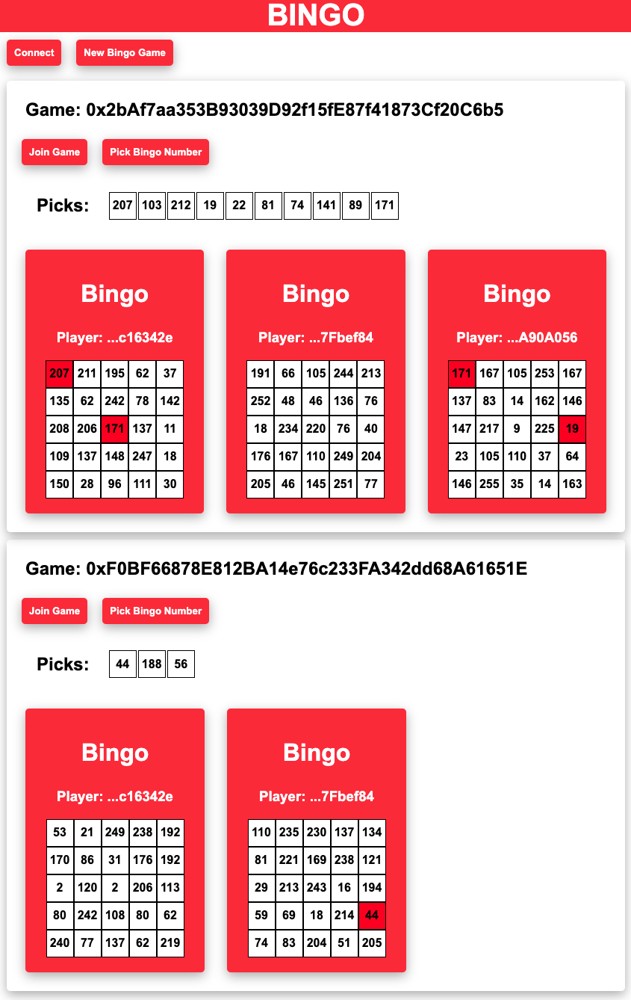

# MetaStreet Bingo Project

This project implements a bingo game using Solidity and includes:

* Bingo and Bingo Factory contracts with tests
* Typescript SDK to interact with the contract on the front end using MetaMask
* Basic front-end that uses the sdk and listens to emitted contract events to display the contract's main features

Bingo contract tests are located in `./test`<br>
Bingo SDK is located in `./bingo-sdk`<br>
Bingo front-end is located in `./frontend`<br>


To run the tests use:
```shell
yarn test
```
To deploy a new instance of the Bingo Factory to Goerli please add the below variables to your .env

`ALCHEMY_API_KEY`<br>
`GOERLI_PRIVATE_KEY`

Then run the below command to deploy to Goerli
```shell
yarn deploy
```

To run the front end locally please add the below variable to your .env after deploying to Goerli

`DEPLOYED_BINGO_FACTORY`

To run the front end using Parcel on http://localhost:1234 use:
```shell
yarn start
```


### Basic Front End View


